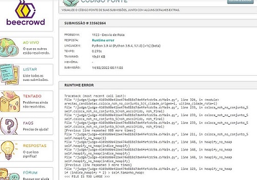

# Grafos2_Exercicios-Beecrowd

**Número da Lista**: 8 
**Conteúdo da Disciplina**: Grafos2 

## Alunos
| Matrícula | Aluno                              |
| --------- | ---------------------------------- |
| 211031664 | Catlen Cleane Ferreira de Oliveira |
| 212002907 | Zenilda Pedrosa Vieira             |

## Sobre 
Escolhemos 5 exercícios do Beecrowd sobre a matéria estudada. 

> Kruskal - Nível 5 - [1152 - Estradas Escuras](1152/Beecrowd_1152_Estradas_Escuras.py) 
> Kruskal - Nível 3 - [1764 - Itinerário do Papai Noel](1764/Beecrowd_1764_Itinerário_do_Papai_Noel.py) 
> Prim - Nível 3 - [2404 - Reduzindo Detalhes em um Mapa](2404/Beecrowd_2404_Reduzindo_Detalhes_em_um_Mapa.py) 
> Prim - Nível 5 - [3144 - G de Grafo](3144/Beecrowd_3144_G_de_Grafo.py) 
> Dijkstra - Nível 4 - [1123 - Desvio de Rota](1123/Beecrowd_1123_Desvio_de_Rota.py) 

Obs.: O código 1123, ao ser submetido ao Beecrowd, gerou Run Time Error. No log fornecido, o erro gerado é "<<< file is too large >>>". Acreditamos que o erro se deu ao log de saída do Beecrowd ter excedido o número máximo de linhas. Pode ter sido em decorrência da linguagem escolhida (Python) e não necessariamente um erro no código, já que o código passa nos testes do Beecrowd até o momento que o buffer do log "estoura". 

## Screenshots

 

 

## Vídeo explicativo

[Apresentacao_Grafos2.mp4](Apresentacao_Grafos2.mp4)

## Instalação 
**Linguagem**: Python 
Os códigos foram feitos em Python 3.11.

## Uso 
Para rodar basta clonar o repositório e usar o comando no terminal (dentro da pasta do arquivo):

    python3 "nome_arquivo.py" < "nome_arq_entradas.txt"

Outra forma de verificar o código é submetê-lo ao juiz do Beecrowd. 
[Beecrowd - 1152 - Estradas Escuras](https://www.beecrowd.com.br/judge/pt/problems/view/1152) 
[Beecrowd - 1764 - Itinerário do Papai Noel](https://www.beecrowd.com.br/judge/pt/problems/view/1764) 
[Beecrowd - 2404 - Reduzindo Detalhes em um Mapa](https://www.beecrowd.com.br/judge/pt/problems/view/2404) 
[Beecrowd - 3144 - G de Grafo](https://www.beecrowd.com.br/judge/pt/problems/view/3144) 
[Beecrowd - 1123 - Desvio de Rota](https://www.beecrowd.com.br/judge/pt/problems/view/1123) 
    
## Outros 
Foram escolhidos um exercício de algoritmo de Dijkstra, dois de Prim e dois de Kruskal.

